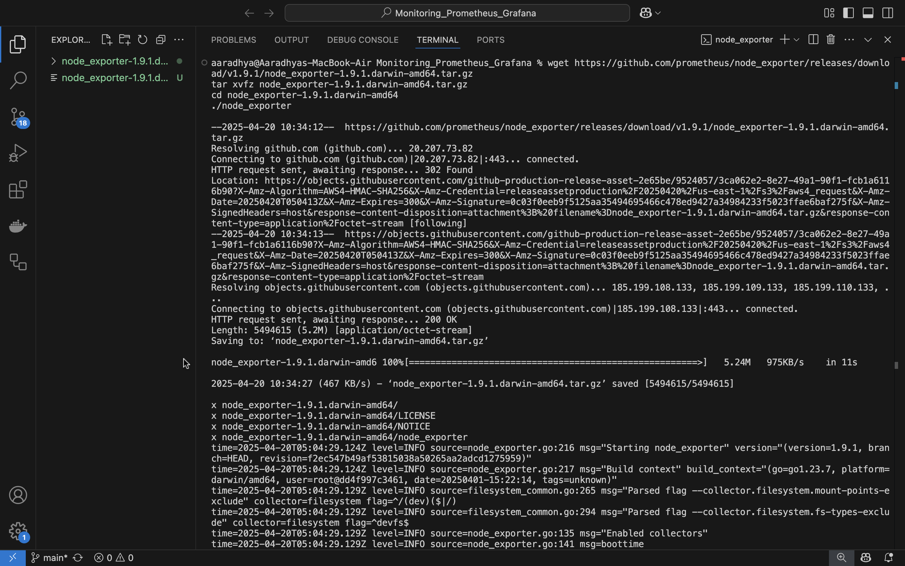
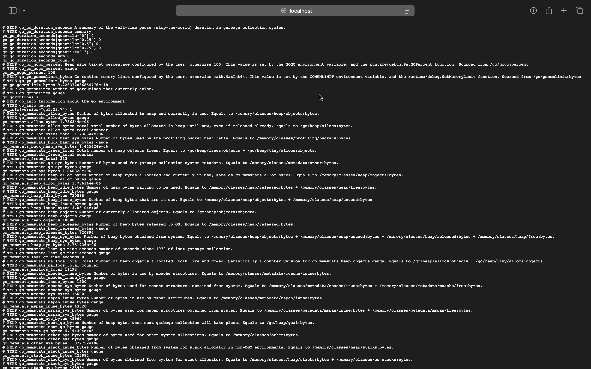
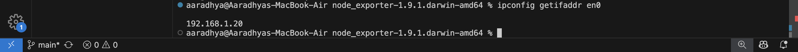
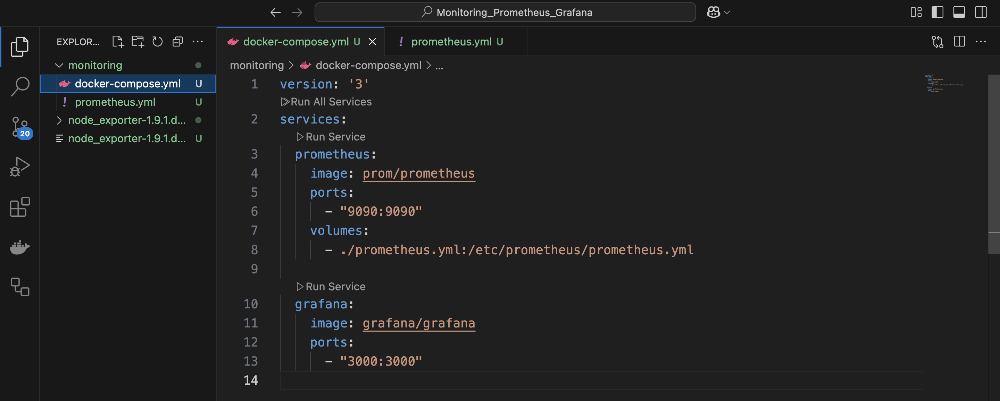
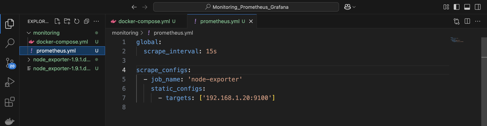
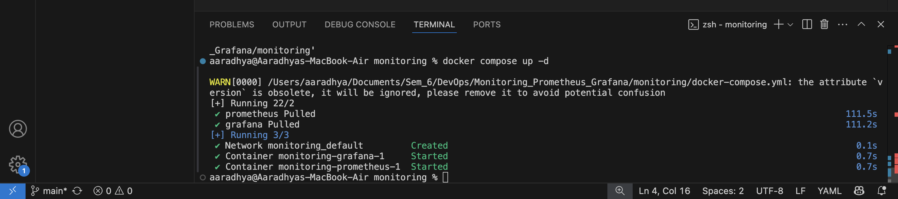
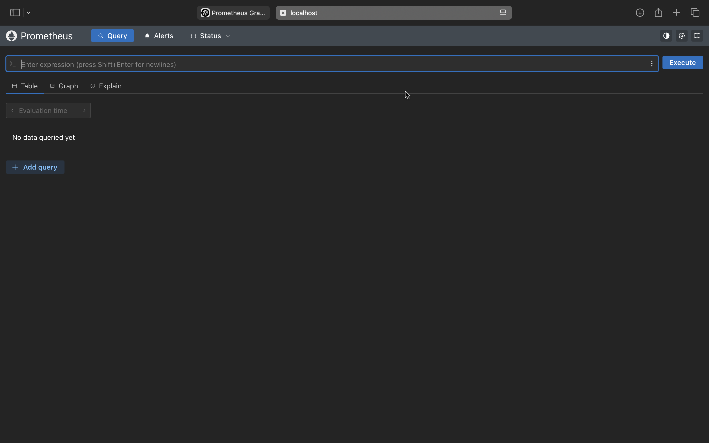
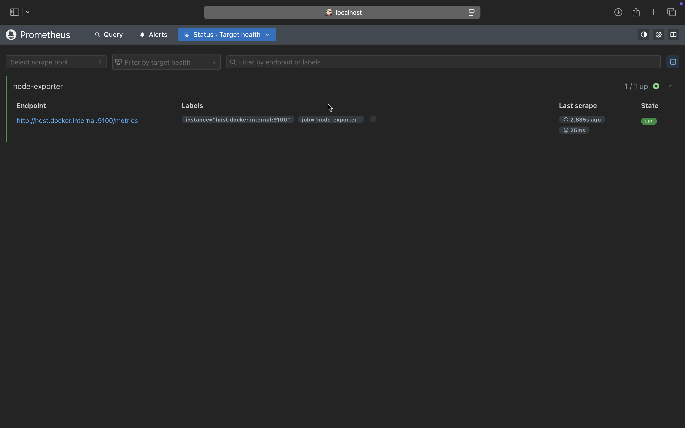
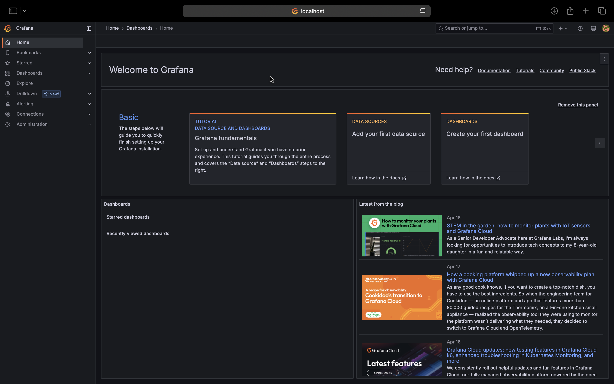
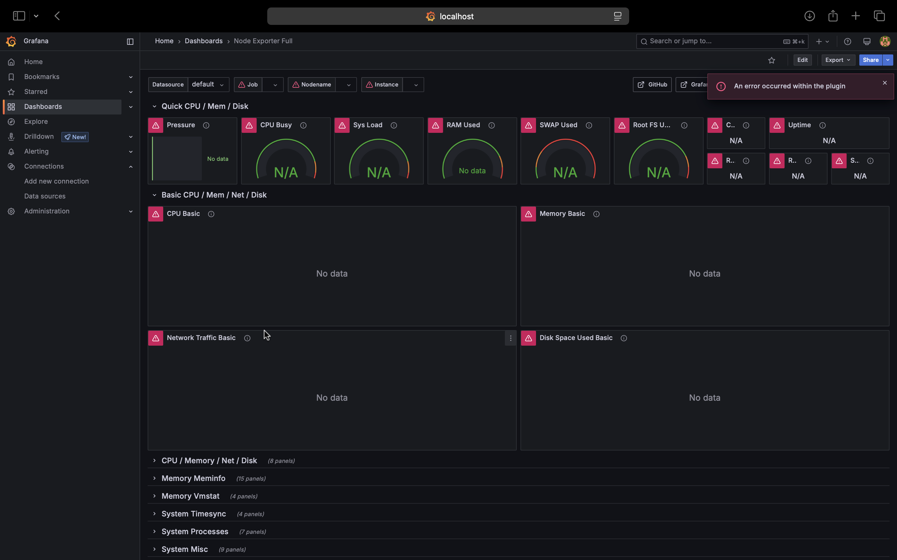

## Monitoring with Prometheus and Grafana

### **🔹 Part 1: Node Exporter Setup**

#### If you're using **WSL/Linux**:
1. Open terminal.
2. Run:
   ```bash
   wget https://github.com/prometheus/node_exporter/releases/download/v1.9.1/node_exporter-1.9.1.linux-amd64.tar.gz
   tar xvfz node_exporter-1.9.1.linux-amd64.tar.gz
   cd node_exporter-1.9.1.linux-amd64
   ./node_exporter
   ```

   
   
4. Visit [http://localhost:9100/metrics](http://localhost:9100/metrics) in browser.

   
   
6. Get your WSL IP:
   ```bash
   hostname -I
   ```
   
   
---

### **🔹 Part 2: Prometheus + Grafana via Docker Compose**

#### Folder structure:
```
monitoring/
├── docker-compose.yml
└── prometheus.yml
```

#### `docker-compose.yml`:
```yaml
version: '3'
services:
  prometheus:
    image: prom/prometheus
    ports:
      - "9090:9090"
    volumes:
      - ./prometheus.yml:/etc/prometheus/prometheus.yml

  grafana:
    image: grafana/grafana
    ports:
      - "3000:3000"
```
   
   
#### `prometheus.yml` (Replace `<WSL_IP>`):
```yaml
global:
  scrape_interval: 15s

scrape_configs:
  - job_name: 'node-exporter'
    static_configs:
      - targets: ['<WSL_IP>:9100']
```
   
   
> You can get `<WSL_IP>` from `hostname -I`. Use only the IP part.

#### Run the stack:
```bash
docker-compose up -d
```
   

   

   
   
---

### **🔹 Part 3: Set Up Grafana Dashboard**

1. Go to [http://localhost:3000](http://localhost:3000) → Login (`admin` / `admin`)
2. Go to **Configuration → Data Sources → Add Data Source**
   - Choose **Prometheus**
   - URL: `http://prometheus:9090`
  
     
     
3. Import Dashboard:
   - Click "+" → **Import**
   - Use **Dashboard ID: `1860`**
   - Set data source → **Import**
     
     
---

### ✅ **Check Everything is Working**

- **Node Exporter**: `http://localhost:9100/metrics`
- **Prometheus**: `http://localhost:9090` → Status → Targets
- **Grafana**: `http://localhost:3000` → Dashboard

